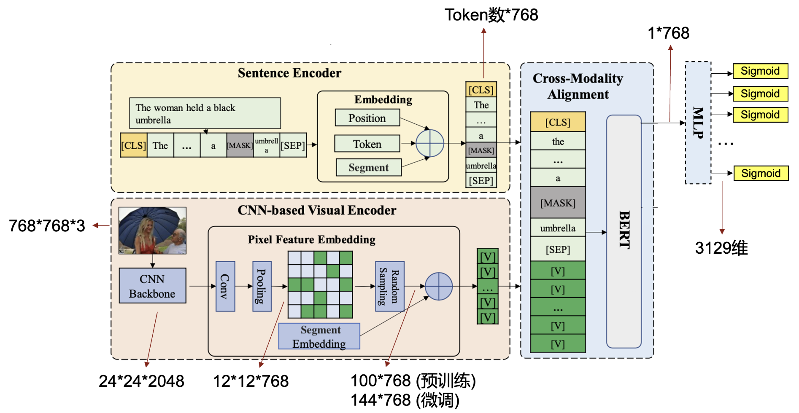

  <h1 align="left">VQA项目</h1>


<!-- TABLE OF CONTENTS -->

<details open="open">
  <summary><h2 style="display: inline-block">目录</h2></summary>
  <ol>
    <li>
      <a href="# 关于本项目">关于本项目</a>
      <ul>
        <li><a href="####模型">模型</a></li>
        <li><a href="# 环境依赖">环境依赖</a></li>
      </ul>
    </li>
    <li>
      <a href="#快速开始">快速开始</a>
      <ul>
        <li><a href="#先决条件">数据集下载</a></li>
        <li><a href="#安装">环境安装</a></li>
      </ul>
    </li>
    <li>
      <a href="#使用方法">使用方法</a>
      <ul>
        <li><a href="#训练">训练</a></li>
        <li><a href="#测试<">测试</a></li>
      </ul>
     </li>
    <li><a href="#结果">结果</a></li>
    <li><a href="#pretrained-model">Pretrained model</a></li>
  </ol>
</details>


<!-- 关于本项目 -->

## 关于本项目
本项目是视觉与语言课程的期末课程作业，任务目标是VQA任务。预训练使用的是COCO Caption和Visual Genome数据，VQA使用的数据集是VQA2.0。


### 模型
在本项目中，使用的是PixelBert模型及其改进(将backbone从ResNet50改为带GC Attentionn的ResNet50)

预训练时的网络结构为:


进行VQA Fintuining时的网络结构为

### 环境依赖

本项目主要需要如下的环境依赖，具体安装方式见快速开始！
* [torch-1.10.0+cu113](https://pytorch.org/get-started/locally/)
* [apex](https://github.com/NVIDIA/apex.git)
* [detectron2-0.1.1]
* [horovod-0.19.4]


<!-- 环境安装 -->

## 快速开始

### 数据集下载

+ 直接下载预处理好的数据和BERT权重, [点击下载](https://disk.pku.edu.cn:443/link/56E7CFFEDEC5150E4E684854D3193324)，解压到与该项目同级的文件夹内。需要使用合并解压，命令示例：
```sh
zip subdata.zip -s=0 --out data.zip
# 解压data.zip
unzip data.zip
```
解压之后的文件目录结构应该为
```sh
.
├── pixelbert
│   
└── vision_and_language_data
    └── data
         ├── pretrained
         ├── txt_db
         └── vis_db
```
### 环境安装

1. 创建新环境
   ```sh
   conda create -n pixelbert python=3.9 &&\
   conda activate pixelbert
   ```

2. 安装torch1.10.0+cu113
   ```sh
   # install torch1.10.0+cu113
   pip3 install torch==1.10.1+cu113 torchvision==0.11.2+cu113 torchaudio==0.10.1+cu113 -f https://download.pytorch.org/whl/cu113/torch_stable.html
   ```

3. 安装部分依赖

   ```sh
   pip install -r requirements.txt
   ```
   
4. 安装apex半精度计算包
   
   ```sh
    git clone https://github.com/NVIDIA/apex.git &&\
    cd apex &&\
    pip install -v --no-cache-dir --global-option="--cpp_ext" --global-option="--cuda_ext" . &&\
    rm -rf ../apex &&\
    cd ..
   ```
   
5. 安装detectron 2

   ```sh
    pip install 'git+https://github.com/facebookresearch/fvcore' &&\
    python -m pip install 'git+https://github.com/facebookresearch/detectron2.git@ffff8ac'
   ```

6. 安装horovod进行多卡分布式训练
    ```sh
    # install horovod
    pip install --no-cache-dir horovod==0.19.4
   ```


<!-- USAGE EXAMPLES -->

## 使用方法

### 训练

1. 使用完整数据预训练pixelbert-resnet50
    ```sh
    horovodrun -np {number of gpus} python run_pretrain_resnet50_fulldata.py \
        --config src/configs/pretrain_image_text_base_resnet50_mlm_itm.json \
        --output_dir  {path to save logs and checkpoints}
    ```

    使用tensorboard可视化训练过程
    ```sh
    tensorboard --logdir={path to save logs} --host={host}
    ```
    示例：
    ```sh
    # pretraining resnet50 vqa full data
    horovodrun -np 1 python run_pretrain_resnet50_fulldata.py \
        --config src/configs/pretrain_image_text_base_resnet50_mlm_itm.json \
        --output_dir  /home/zhangzr/vision_and_language_data/resnet50_pretrain_output

    tensorboard --logdir=/home/zhangzr/vision_and_language_data/resnet50_pretrain_output/log/ --host=162.105.94.222
    ```

2. 完整数据预训练之后，对pixelbert-resnet50 进行vqa FineTuning
   ```sh
    horovodrun -np {number of gpus} python run_vqa_resnet50.py \
    --config src/configs/vqa_base_resnet50.json \
    --output_dir {path to save logs and checkpoints}
    ```
    使用tensorboard可视化训练过程
    ```sh
    tensorboard --logdir={path to save logs} --host={host}
    ```

    示例：
    ```sh
    # resnet50-vqa
    horovodrun -np 1 python run_vqa_resnet50.py \
        --config /home/zhangzr/pixelbert/src/configs/vqa_base_resnet50.json \
        --output_dir /home/zhangzr/vision_and_language_data/resnet50_vqa_result


    tensorboard --logdir=/home/zhangzr/vision_and_language_data/resnet50_vqa_result/log/ --host=162.105.94.222
    ```

3. 使用完整数据预训练pixelbert-resnet50withgcb
   ```sh
    horovodrun -np {number of gpus} python run_pretrain_resnet50with_gcb.py \
    --config src/configs/pretrain_image_text_base_resnet50withgcb_mlm_itm.json \
    --output_dir {path to save logs and checkpoints}
    ```
    使用tensorboard可视化训练过程
    ```sh
    tensorboard --logdir={path to save logs} --host={host}
    ```
    示例：
    ```sh
    # pretraining resnet50withgcb vqa full data
    horovodrun -np 1 python run_pretrain_resnet50with_gcb.py \
        --config src/configs/pretrain_image_text_base_resnet50withgcb_mlm_itm.json \
        --output_dir  /home/zhangzr/vision_and_language_data/resnet50withgcb_pretrain_output

    tensorboard --logdir=/home/zhangzr/vision_and_language_data/resnet50withgcb_pretrain_output/log/ --host=162.105.94.222
    ```

4. 完整数据预训练之后，对pixelbert-resnet50withgcb vqa 进行vqa FineTuning
    ```sh
    horovodrun -np {number of gpus} python run_vqa_resnet50with_gcb.py \
    --config src/configs/vqa_base_resnet50_with_gcb.json \
    --output_dir {path to save logs and checkpoints}
    ```
    使用tensorboard可视化训练过程
    ```sh
    tensorboard --logdir={path to save logs} --host={host}
    ```

    示例：
    ```sh
    # resnet50withgcb vqa
    horovodrun -np 1 python run_vqa_resnet50with_gcb.py \
        --config /home/zhangzr/pixelbert/src/configs/vqa_base_resnet50_with_gcb.json \
        --output_dir /home/zhangzr/vision_and_language_data/resnet50_with_gcb_vqa_result/


    tensorboard --logdir=/home/zhangzr/vision_and_language_data/resnet50_with_gcb_vqa_result/log/ --host=162.105.94.222
    ```

5. 只使用coco数据预训练pixelbert-resnet50withgcb
    ```sh
    horovodrun -np {number of gpus} python run_pretrain_resnet50with_gcb.py \
    --config src/configs/pretrain_image_text_base_resnet50withgcb_mlm_itm_coco_cap.json \
    --output_dir {path to save logs and checkpoints}
    ```
    使用tensorboard可视化训练过程
    ```sh
    tensorboard --logdir={path to save logs} --host={host}
    ```
    示例：
    ```sh
    # pretraining resnet50withgcb vqa less data
    horovodrun -np 1 python run_pretrain_resnet50with_gcb.py \
        --config src/configs/pretrain_image_text_base_resnet50withgcb_mlm_itm_coco_cap.json\
        --output_dir  /home/zhangzr/vision_and_language_data/resnet50withgcb_lessdata_pretrain_lessdata_output

    tensorboard --logdir=/home/zhangzr/vision_and_language_data/resnet50withgcb_lessdata_pretrain_lessdata_output/log/ --host=162.105.94.222
    ```
6. 只使用coco数据预训练pixelbert-resnet50withgcb后进行vqa FineTuning
    ```sh
    horovodrun -np {number of gpus} python run_vqa_resnet50with_gcb.py \
    --config src/configs/vqa_base_resnet50_with_gcb_lessdata.json \
    --output_dir {path to save logs and checkpoints}
    ```
    使用tensorboard可视化训练过程
    ```sh
    tensorboard --logdir={path to save logs} --host={host}
    ```
    示例：
    ```sh
    # resnet50withgcb vqa lessdata
    horovodrun -np 1 python run_vqa_resnet50with_gcb.py \
        --config /home/zhangzr/pixelbert/src/configs/vqa_base_resnet50_with_gcb_lessdata.json \
        --output_dir /home/zhangzr/vision_and_language_data/resnet50_with_gcb_vqa_lessdata_result/


    tensorboard --logdir=/home/zhangzr/vision_and_language_data/resnet50_with_gcb_vqa_lessdata_result/log/ --host=162.105.94.222

    ```

7. 只使用coco数据预训练pixelbert-resnet50
    ```sh
    horovodrun -np {number of gpus} python run_pretrain_resnet50_lessdata.py \
    --config src/configs/pretrain_image_text_base_resnet50_mlm_itm_coco_cap.json \
    --output_dir {path to save logs and checkpoints}
    ```
    使用tensorboard可视化训练过程
    ```sh
    tensorboard --logdir={path to save logs} --host={host}
    ```
    示例：
    ```sh
    # pretraining resnet50 vqa less data
    horovodrun -np 1 python run_pretrain_resnet50_lessdata.py \
        --config /home/zhangzr/pixelbert/src/configs/pretrain_image_text_base_resnet50_mlm_itm_coco_cap.json\
        --output_dir  /home/zhangzr/vision_and_language_data/resnet50_pretrain_lessdata_output

    tensorboard --logdir=/home/zhangzr/vision_and_language_data/resnet50_pretrain_lessdata_output/log/ --host=162.105.94.222

    ```

8. 只使用coco数据预训练pixelbert-resnet50后进行vqa FineTuning
    ```sh
    horovodrun -np {number of gpus} python run_vqa_resnet50_lessdata.py \
    --config src/configs/vqa_base_resnet50_lessdata.json \
    --output_dir {path to save logs and checkpoints}
    ```
    使用tensorboard可视化训练过程
    ```sh
    tensorboard --logdir={path to save logs} --host={host}
    ```
    示例：
    ```sh
    # resnet50 vqa lessdata
    horovodrun -np 1 python run_vqa_resnet50_lessdata.py \
        --config /home/zhangzr/pixelbert/src/configs/vqa_base_resnet50_lessdata.json \
        --output_dir /home/zhangzr/vision_and_language_data/resnet50_vqa_lessdata_result/


    tensorboard --logdir=/home/zhangzr/vision_and_language_data/resnet50_vqa_lessdata_result/log/ --host=162.105.94.222
    ```
### 预测

1. pixelbert-resnet50 完整数据预训练之后对vqa数据集验证集进行预测

   ```shell
    horovodrun -np 1 python run_vqa_resnet50.py \
    --do_inference 1\
    --output_dir {path where save logs and checkpoints during training} \
    --inference_split val\
    --inference_model_step {checkpoint_saved} \
    --inference_txt_db {text_data} \
    --inference_img_db {img_dir} \
    --inference_batch_size {batch_size}
   ```

   示例：
   ```shell
    # inference resnet50-vqa
    horovodrun -np 1 python run_vqa_resnet50.py \
    --do_inference 1 --output_dir /home/zhangzr/vision_and_language_data/resnet50_vqa_result \
    --inference_split val --inference_model_step 22400 \
    --inference_txt_db /home/zhangzr/vision_and_language_data/data/txt_db/vqa/vqa_k_test.jsonl \
    --inference_img_db /home/zhangzr/vision_and_language_data/data/vis_db/coco_train2014_val2014 \
    --inference_batch_size 32
   ```

2. pixelbert-resnet50 只使用coco数据预训练之后对vqa数据集验证集进行预测

   ```shell
    horovodrun -np 1 python run_vqa_resnet50_lessdata.py \
    --do_inference 1\
    --output_dir {path where save logs and checkpoints during training} \
    --inference_split val\
    --inference_model_step {checkpoint_saved} \
    --inference_txt_db {text_data} \
    --inference_img_db {img_dir} \
    --inference_batch_size {batch_size}
   ```
   示例：
   ```shell
    # inference resnet50 vqa lessdata
    horovodrun -np 1 python run_vqa_resnet50_lessdata.py \
    --do_inference 1 --output_dir /home/zhangzr/vision_and_language_data/resnet50_vqa_lessdata_result\
    --inference_split val --inference_model_step 89900 \
    --inference_txt_db /home/zhangzr/vision_and_language_data/data/txt_db/vqa/vqa_k_test.jsonl \
    --inference_img_db /home/zhangzr/vision_and_language_data/data/vis_db/coco_train2014_val2014 \
    --inference_batch_size 2
   ```

3. pixelbert-resnet50withgcb 完整数据预训练之后对vqa数据集验证集进行预测

   ```shell
    horovodrun -np 1 python run_vqa_resnet50with_gcb.py \
    --do_inference 1\
    --output_dir {path where save logs and checkpoints during training} \
    --inference_split val\
    --inference_model_step {checkpoint_saved} \
    --inference_txt_db {text_data} \
    --inference_img_db {img_dir} \
    --inference_batch_size {batch_size}
   ```

   示例：
   ```shell
    # inference resnet50withgcb vqa
    horovodrun -np 1 python run_vqa_resnet50with_gcb.py \
    --do_inference 1 --output_dir /home/zhangzr/vision_and_language_data/resnet50_with_gcb_vqa_result\
    --inference_split val --inference_model_step 26400 \
    --inference_txt_db /home/zhangzr/vision_and_language_data/data/txt_db/vqa/vqa_k_test.jsonl \
    --inference_img_db /home/zhangzr/vision_and_language_data/data/vis_db/coco_train2014_val2014 \
    --inference_batch_size 2
   ```

4. pixelbert-resnet50withgcb 只使用coco数据预训练之后对vqa数据集验证集进行预测

   ```shell
    horovodrun -np 1 python run_vqa_resnet50with_gcb.py \
    --do_inference 1\
    --output_dir {path where save logs and checkpoints during training} \
    --inference_split val\
    --inference_model_step {checkpoint_saved} \
    --inference_txt_db {text_data} \
    --inference_img_db {img_dir} \
    --inference_batch_size {batch_size}
   ```

   示例：
   ```shell
    # inference resnet50withgcb vqa lessdata
    horovodrun -np 1 python run_vqa_resnet50with_gcb.py \
    --do_inference 1 --output_dir /home/zhangzr/vision_and_language_data/resnet50_with_gcb_vqa_lessdata_result\
    --inference_split val --inference_model_step 19200 \
    --inference_txt_db /home/zhangzr/vision_and_language_data/data/txt_db/vqa/vqa_k_test.jsonl \
    --inference_img_db /home/zhangzr/vision_and_language_data/data/vis_db/coco_train2014_val2014 \
    --inference_batch_size 2
   ```


   

<!-- Result -->

## 结果
|                         模型                             |    预训练数据   |    Overall ACC  |
| :-----------------------------------------------------: |    :--------:  |     :--------:  |     
|               本项目复现 Pixel-BERT (ResNet50)            |   COCO + VG    |       66.36     |
|               本项目改进 Pixel-BERT (ResNet50 with GCB)   |   COCO + VG（未预训练至收敛）    |       59.10      |
|               本项目复现 Pixel-BERT (ResNet50)            |       COCO     |       54.44      |
|               本项目改进 Pixel-BERT (ResNet50 with GCB)   |       COCO     |       56.57      |


<!-- Pretrain Model -->

## Pretrained Model
预训练模型可[点击下载](https://disk.pku.edu.cn:443/link/22C4017B7B593BE2554328E74F71D625)，文件结构为
```shell
.
├── data
│   ├── pretrained
│   │   └── bert-base-uncased
│   ├── txt_db
│   │   ├── pretrain
│   │   └── vqa
│   └── vis_db
│       ├── coco_test2015
│       ├── coco_train2014_val2014
│       └── vg
├── resnet50_pretrain_lessdata_output
│   ├── ckpt
│   └── log
├── resnet50_pretrain_output
│   └── ckpt
├── resnet50_vqa_lessdata_result
│   ├── ckpt
│   ├── log
│   └── results_valstep_89900
├── resnet50_vqa_result
│   ├── ckpt
│   ├── log
│   └── results_valstep_22400
├── resnet50withgcb_lessdata_pretrain_lessdata_output
│   ├── ckpt
│   └── log
├── resnet50withgcb_pretrain_output
│   ├── ckpt
│   └── log
├── resnet50_with_gcb_vqa_lessdata_result
│   ├── ckpt
│   ├── log
│   └── results_valstep_19200
└── resnet50_with_gcb_vqa_result
    ├── ckpt
    ├── log
    └── results_valstep_26400
```


